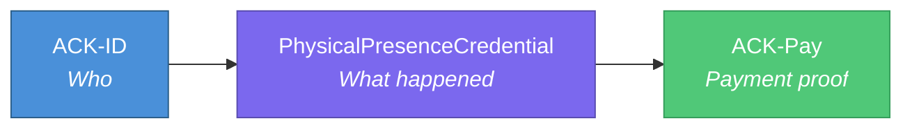

# ACK Physical Presence Credential Schema

A W3C Verifiable Credential schema for proving that real-world physical activity occurred. Proposed as an extension to the [ACK ecosystem](https://github.com/ack-protocol).

## The Problem

**ACK-Pay** proves that money moved. But nothing proves the real-world event that triggered the payment.

When a fitness app rewards a user for walking 10,000 steps, the payment itself is verifiable on-chain — but there is no standardized, portable proof that the steps actually happened. The same gap exists for gym visits, delivery confirmations, event attendance, and any scenario where a payment is triggered by a physical-world event.

Without a credential linking the real-world activity to the payment, reward systems are:
- **Opaque** — sponsors cannot audit what they paid for
- **Siloed** — activity proof is locked inside one app
- **Unverifiable** — there is no interoperable way to attest "this happened"

## Proposed Solution

The **PhysicalPresenceCredential** is a W3C Verifiable Credential that attests: *a specific activity occurred, at a specific place and time, validated by specific methods, with a given confidence level.*

It does **not** define how validation works — that is application-specific. It defines a **data format standard** so that any issuer can produce credentials that any verifier can consume.

## Trust Chain



| Layer | Role | Standard |
|-------|------|----------|
| **ACK-ID** | Identifies the subject (DID) | W3C DID |
| **PhysicalPresenceCredential** | Attests the real-world event | W3C VC (this schema) |
| **ACK-Pay** | Proves the resulting payment | On-chain transaction |

Together, these three layers create an end-to-end auditable chain: **who** did **what**, and **what they were paid** for it.

## Use Cases

| Use Case | Activity Type | Key Metrics | Sponsor |
|----------|--------------|-------------|---------|
| **Fitness Rewards** | Walking, running, cycling | Steps, distance, duration, calories | Health insurers, wellness brands |
| **Location Loyalty** | Visiting a store or venue | Geohash, dwell time | Retailers, restaurants |
| **Insurance Verification** | Exercise for premium discounts | Activity frequency, consistency | Insurance companies |
| **Delivery Confirmation** | Package delivery to address | Location, timestamp, photo hash | Logistics companies |
| **Event Attendance** | Attending a conference or class | Venue geohash, duration | Event organizers, universities |

## Schema

The full JSON-LD context definition:

```json
{
  "@context": {
    "PhysicalPresenceCredential": "https://schema.org/PhysicalPresenceCredential",
    "activityType": "https://schema.org/exerciseType",
    "metrics": {
      "stepCount": "https://schema.org/Integer",
      "distanceMeters": "https://schema.org/Float",
      "durationSeconds": "https://schema.org/Integer",
      "caloriesBurned": "https://schema.org/Float"
    },
    "location": {
      "geohash": "https://schema.org/Text",
      "precision": "https://schema.org/Text",
      "method": "https://schema.org/Text"
    },
    "validation": {
      "method": "https://schema.org/Text",
      "sources": "https://schema.org/ItemList",
      "confidenceScore": "https://schema.org/Float"
    },
    "campaign": {
      "id": "https://schema.org/identifier",
      "sponsor": "https://schema.org/Text"
    },
    "device": {
      "attestation": "https://schema.org/Text",
      "type": "https://schema.org/Text"
    }
  }
}
```

## Example Credential

```json
{
  "@context": [
    "https://www.w3.org/2018/credentials/v1",
    "https://ack-protocol.github.io/ack-physical-presence-schema/v1"
  ],
  "type": ["VerifiableCredential", "PhysicalPresenceCredential"],
  "issuer": "did:ack:issuer:fitness-app-123",
  "issuanceDate": "2026-03-17T14:30:00Z",
  "expirationDate": "2026-04-17T14:30:00Z",
  "credentialSubject": {
    "id": "did:ack:user:abc123",
    "activityType": "walking",
    "metrics": {
      "stepCount": 10342,
      "distanceMeters": 7850.5,
      "durationSeconds": 5400,
      "caloriesBurned": 420.0
    },
    "location": {
      "geohash": "dpz83d",
      "precision": "neighborhood",
      "method": "device-gps"
    },
    "validation": {
      "method": "multi-source",
      "sources": ["accelerometer", "gps", "health-api"],
      "confidenceScore": 0.92
    },
    "campaign": {
      "id": "campaign:walk-march-2026",
      "sponsor": "HealthCo Wellness"
    },
    "device": {
      "attestation": "android-key-attestation",
      "type": "smartphone"
    }
  }
}
```

## Key Design Decisions

1. **Geohash, not raw GPS** — Location is expressed as a geohash with explicit precision level, preserving privacy while proving approximate location. See [SPECIFICATION.md](./SPECIFICATION.md) for details.

2. **Validation is a black box** — The `validation.confidenceScore` field is application-specific. This schema defines the field but not how to compute it. Different issuers will use different validation methods appropriate to their use case.

3. **Extensible metrics** — The `metrics` object covers common physical activity fields. Applications can extend it with additional fields for domain-specific measurements.

## Repository Structure

```
schemas/
  physical-presence-credential.json   # JSON-LD context definition
  verified-activity-credential.json   # Generalized activity credential
examples/
  walking-reward.json                 # Fitness reward example
  gym-visit.json                      # Gym visit verification example
  delivery-confirmation.json          # Delivery proof example
src/
  issue-credential.ts                 # Issue and sign credentials
  verify-credential.ts               # Verify credential signatures
  demo.ts                            # End-to-end demonstration
SPECIFICATION.md                      # Formal specification
```

## Getting Started

```bash
npm install
npx ts-node src/demo.ts
```

## Related

- [W3C Verifiable Credentials Data Model](https://www.w3.org/TR/vc-data-model/)
- [W3C Decentralized Identifiers](https://www.w3.org/TR/did-core/)
- [ACK Protocol](https://github.com/ack-protocol)

## License

MIT
